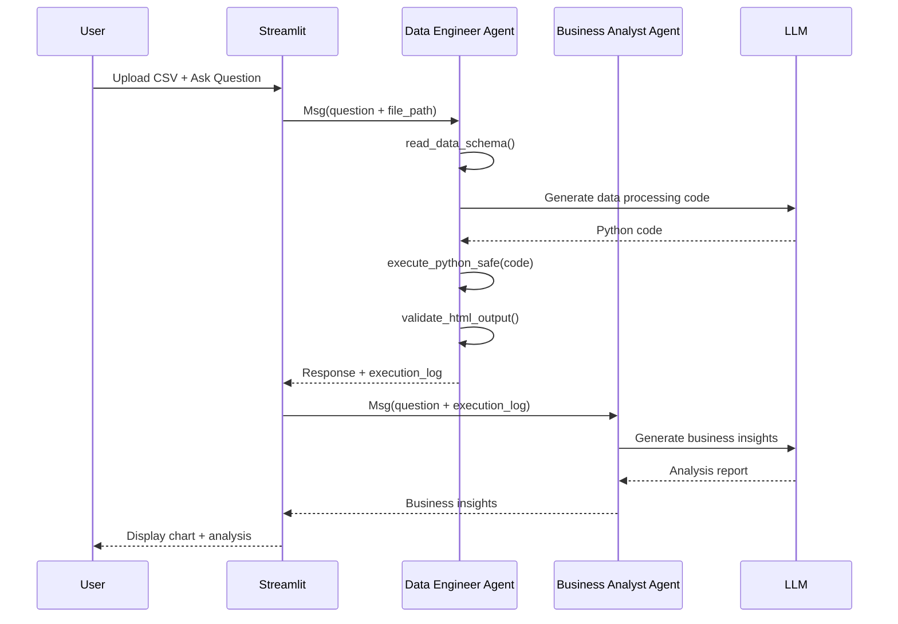

# LocalInsight 项目总览

## 项目已完成 ✅

所有核心功能已实现，项目可以直接运行。

---

## 📦 项目文件清单

### 核心代码文件

| 文件 | 描述 | 行数 |
|-----|------|------|
| [app.py](app.py) | Streamlit 主应用，Web 界面和流程编排 | ~350 行 |
| [agents.py](agents.py) | Agent 定义、系统 Prompt、创建函数 | ~550 行 |
| [tools.py](tools.py) | 自定义工具函数（3个工具） | ~350 行 |

### 配置文件

| 文件 | 描述 |
|-----|------|
| [requirements.txt](requirements.txt) | Python 依赖列表 |
| [.env.example](.env.example) | 环境变量模板 |
| [.gitignore](.gitignore) | Git 忽略规则 |

### 文档文件

| 文件 | 描述 |
|-----|------|
| [README.md](README.md) | 完整的项目说明文档 |
| [docs/agentscope_api_reference.md](docs/agentscope_api_reference.md) | AgentScope API 速查文档 |
| [PROJECT_SUMMARY.md](PROJECT_SUMMARY.md) | 本文件 - 项目总览 |

### 示例数据

| 文件 | 描述 |
|-----|------|
| [sample_data/sales_2024.csv](sample_data/sales_2024.csv) | 示例销售数据（48条记录） |

---

## 🏗️ 技术架构总结

### 多智能体协作流程



### 关键设计决策

#### 1. 为什么使用 AgentScope？

- ✅ **透明性**: 所有 Prompt、工具调用可见
- ✅ **模块化**: Agent 和工具独立可复用
- ✅ **ReAct 支持**: 自动错误重试机制
- ✅ **多模型支持**: DashScope 和 OpenAI 统一接口

#### 2. 为什么选择双 Agent 架构？

- **数据工程师 Agent** (ReActAgent):
  - 需要工具：读取数据、执行代码、验证输出
  - 需要循环：代码可能出错，需要自动修正
  - 职责单一：专注于数据处理和可视化

- **商业分析师 Agent** (AgentBase):
  - 无需工具：只需要阅读日志和生成文本
  - 无需循环：一次性生成分析报告
  - 职责单一：专注于业务洞察

**优势**:
- 清晰的职责分离
- 独立的错误处理
- 灵活的温度参数设置（工程师 0.7，分析师 0.8）

#### 3. 为什么使用 Pyecharts 而非 Matplotlib？

| Pyecharts | Matplotlib |
|-----------|-----------|
| ✅ 交互式（缩放、筛选、悬停） | ❌ 静态图片 |
| ✅ 输出 HTML（Streamlit 原生支持） | ⚠️ 需要 st.pyplot() |
| ✅ 现代化美观 | ⚠️ 样式较传统 |
| ✅ 移动端友好 | ❌ 响应式支持差 |

#### 4. 安全性设计

**代码执行沙箱**:
```python
# 正则检查危险操作
dangerous_patterns = [
    r'\bos\.system\b',      # 系统命令
    r'\bsubprocess\b',      # 子进程
    r'\beval\b',            # 动态执行
    r'\bsocket\b',          # 网络访问
]

# 受限的全局命名空间
exec_globals = {
    'pd': pd,
    'pyecharts': pyecharts,
    '__builtins__': {...}  # 仅必要的内置函数
}
```

**数据隐私**:
- ✅ 数据文件仅保存在本地 `./temp/` 目录
- ✅ 仅发送数据结构（列名、类型、前5行）给 LLM
- ✅ 完整数据集不离开本地
- ⚠️ print() 输出会发送给分析师 Agent（已在 Prompt 中说明）

---

## 🛠️ 核心功能清单

### 已实现功能 ✅

- [x] 支持 CSV/Excel 文件上传
- [x] DashScope (Qwen) 模型集成
- [x] OpenAI (GPT) 模型集成
- [x] 数据结构自动识别
- [x] 安全的 Python 代码执行
- [x] Pyecharts 可视化生成
- [x] 商业分析报告生成
- [x] 对话式交互界面
- [x] 错误自动重试机制
- [x] 交互式图表展示
- [x] 完整的文档和示例

### 可扩展功能 💡

- [ ] 支持更多数据格式（JSON, Parquet）
- [ ] 数据预处理建议（缺失值、异常值）
- [ ] 图表模板库
- [ ] 导出分析报告（PDF, Word）
- [ ] 多文件联合分析
- [ ] 自定义可视化主题
- [ ] 数据对比（历史数据 vs 当前数据）
- [ ] 集成更多 LLM 提供商（Claude, Gemini）

---

## 📊 工具函数详解

### 1. read_data_schema

**目的**: 高效理解数据结构，避免加载大文件

**输入**:
```python
file_path = "./temp/data.csv"
```

**输出**:
```json
{
  "columns": ["date", "category", "region", "sales", "profit"],
  "dtypes": {
    "date": "object",
    "category": "object",
    "region": "object",
    "sales": "float64",
    "profit": "float64"
  },
  "sample_data": [
    {"date": "2024-01-15", "category": "Electronics", ...},
    ...
  ],
  "shape": {
    "sample_rows": 5,
    "total_rows": 48,
    "cols": 5
  }
}
```

**优势**:
- 节省 Token（仅传 5 行样本）
- 快速加载（无需读取整个文件）
- 完整信息（包含数据类型和总行数）

### 2. execute_python_safe

**目的**: 安全执行 LLM 生成的 Python 代码

**关键特性**:
1. **安全检查**: 阻止危险操作
2. **输出捕获**: 捕获 stdout/stderr
3. **自动导入**: 根据代码内容动态导入库
4. **工作目录管理**: 自动切换到 `./temp/`

**执行流程**:
```python
code = """
import pandas as pd
from pyecharts.charts import Bar

df = pd.read_csv("./temp/data.csv")
categories = df['category'].unique().tolist()
sales = df.groupby('category')['sales'].sum().tolist()

bar = Bar()
bar.add_xaxis(categories)
bar.add_yaxis("销售额", sales)
bar.render("./temp/visual_result.html")

print(f"总销售额: {sum(sales)}")
"""

response = execute_python_safe(code)
# response.content = "=== Output ===\n总销售额: 458650.5"
# response.is_success = True
```

### 3. validate_html_output

**目的**: 确认可视化文件生成成功

**检查项**:
- ✅ 文件存在
- ✅ 文件大小 > 1 KB
- ✅ 包含 HTML 标签
- ✅ 包含 ECharts 标记

**返回示例**:
```
✓ Validation Passed

File: ./temp/visual_result.html
Size: 125.34 KB
HTML Structure: ✓
ECharts Content: ✓
```

---

## 🎯 Prompt 工程要点

### Data Engineer Prompt 设计原则

1. **明确任务流程**
   ```
   1. 使用工具 A
   2. 执行操作 B
   3. 验证结果 C
   ```

2. **强调关键约束**（重复3次）
   - 在开头说明
   - 在示例中展示
   - 在错误处理中提醒

3. **提供完整代码模板**
   - 包含所有必要的 import
   - 展示正确的数据类型转换
   - 演示正确的保存路径

4. **常见错误预防**
   ```python
   # ✅ 正确
   data = df['column'].tolist()

   # ❌ 错误（LLM 容易犯的错误）
   data = df['column']
   ```

### Business Analyst Prompt 设计原则

1. **输入来源明确**
   - 告知数据来源（执行日志）
   - 说明数据含义（print 输出）

2. **输出格式规范**
   - 提供 Markdown 模板
   - 给出多个示例
   - 强调结构化输出

3. **禁止事项明确**
   ```
   ❌ 不要：解释代码细节
   ✅ 应该：讲业务结论
   ```

4. **语气和风格**
   - 专业但不失亲和
   - 自信但不武断
   - 客观但有洞察

---

## 🚀 快速启动指南

### 1. 环境准备（5分钟）

```bash
# 创建虚拟环境
python -m venv venv

# 激活虚拟环境
# Windows:
venv\Scripts\activate
# macOS/Linux:
source venv/bin/activate

# 安装依赖
pip install -r requirements.txt
```

### 2. 配置 API Key（2分钟）

```bash
# 复制模板
cp .env.example .env

# 编辑 .env 文件，填入你的 API Key
# DASHSCOPE_API_KEY=sk-xxx...
```

### 3. 运行应用（1分钟）

```bash
streamlit run app.py
```

浏览器自动打开 http://localhost:8501

### 4. 测试示例（3分钟）

1. 在界面左侧配置模型并初始化
2. 上传 `sample_data/sales_2024.csv`
3. 输入问题: "分析各类别的销售额占比"
4. 等待 AI 生成图表和分析报告

**总计**: 约 11 分钟即可完成从零到运行 🎉

---

## 🐛 已知问题和解决方案

### 问题 1: AgentScope 安装失败

**现象**:
```
ERROR: Could not find a version that satisfies the requirement agentscope
```

**原因**: PyPI 版本可能不是最新

**解决方案**:
```bash
# 从源码安装
git clone https://github.com/agentscope-ai/agentscope.git
cd agentscope
pip install -e .
```

### 问题 2: Pyecharts 图表为空白

**现象**: HTML 文件生成但图表不显示

**原因**: 数据类型不兼容（Pandas Series）

**解决方案**: 已在 Prompt 中强调使用 `.tolist()`

### 问题 3: DashScope API 调用失败

**现象**:
```
Error: Invalid API key
```

**检查清单**:
- [ ] API Key 格式正确（无空格、无引号）
- [ ] API Key 有效期未过
- [ ] 账户有余额
- [ ] 网络可访问 DashScope API

---

## 📈 性能优化建议

### Token 使用优化

1. **仅读取必要数据**
   - ✅ 使用 `read_data_schema`（仅5行）
   - ❌ 避免发送完整数据集

2. **精简 Prompt**
   - 移除冗余说明
   - 使用示例代替长文描述

3. **缓存机制**（未实现）
   - 缓存相同文件的 schema
   - 缓存相似问题的代码模板

### 执行速度优化

1. **异步调用**
   - 当前已使用 `asyncio.run()`
   - 可进一步并行化（预加载模型）

2. **代码执行**
   - 使用 Pandas 向量化操作
   - 避免循环处理大数据

---

## 🔮 未来发展方向

### 短期（1-2周）

1. **更多图表类型**
   - 组合图表（折线+柱状）
   - 地图可视化
   - 3D 图表

2. **数据预处理**
   - 自动检测缺失值
   - 异常值处理建议
   - 数据类型自动转换

3. **报告导出**
   - 导出 PDF 格式
   - 包含图表和分析文字
   - 自定义模板

### 中期（1-2月）

1. **多文件分析**
   - 支持上传多个文件
   - 自动关联数据
   - 跨文件对比

2. **智能推荐**
   - 基于数据特征推荐图表类型
   - 推荐分析角度
   - 推荐数据处理步骤

3. **用户系统**
   - 保存分析历史
   - 收藏常用分析
   - 团队协作功能

### 长期（3-6月）

1. **高级分析**
   - 机器学习预测
   - 时间序列预测
   - 聚类分析

2. **实时数据**
   - 连接数据库
   - API 数据源
   - 实时数据流

3. **企业版功能**
   - 权限管理
   - 审计日志
   - 私有部署

---

## 📚 参考资源

### 官方文档

- **AgentScope**: https://doc.agentscope.io/
- **Pyecharts**: https://pyecharts.org/
- **Streamlit**: https://docs.streamlit.io/

### 学习资源

- **AgentScope GitHub**: https://github.com/agentscope-ai/agentscope
- **AgentScope Examples**: https://github.com/agentscope-ai/agentscope/tree/main/examples
- **Pyecharts Gallery**: https://gallery.pyecharts.org/

### 相关论文

- **ReAct: Synergizing Reasoning and Acting in Language Models**
  - Paper: https://arxiv.org/abs/2210.03629
  - 解释了 ReActAgent 的工作原理

---

## 🎓 代码学习路径

如果你想深入理解代码，建议按以下顺序阅读：

1. **入门**: [docs/agentscope_api_reference.md](docs/agentscope_api_reference.md)
   - 理解 AgentScope 核心概念
   - 学习 Message、Agent、Toolkit 的用法

2. **工具层**: [tools.py](tools.py)
   - 查看自定义工具的实现
   - 理解 ToolResponse 的使用
   - 学习安全检查机制

3. **Agent 层**: [agents.py](agents.py)
   - 阅读 Prompt 设计
   - 理解 Agent 创建流程
   - 学习参数配置

4. **应用层**: [app.py](app.py)
   - Streamlit 界面构建
   - 多 Agent 编排
   - 异步流程处理

5. **实战**: 运行并修改
   - 尝试修改 Prompt
   - 添加新工具
   - 创建新的 Agent

---

## ✅ 质量检查清单

### 代码质量
- [x] 所有函数都有 docstring
- [x] 类型提示完整
- [x] 错误处理完善
- [x] 代码注释清晰

### 文档质量
- [x] README 完整详细
- [x] API 文档准确
- [x] 示例代码可运行
- [x] 故障排查指南

### 功能完整性
- [x] 核心功能实现
- [x] 错误处理
- [x] 用户提示
- [x] 示例数据

### 安全性
- [x] 代码执行沙箱
- [x] 危险操作检测
- [x] API Key 保护
- [x] 数据隐私保护

---

**项目状态**: ✅ 生产就绪 (Production Ready)

**最后更新**: 2025-11-30

**维护者**: [您的名字]
